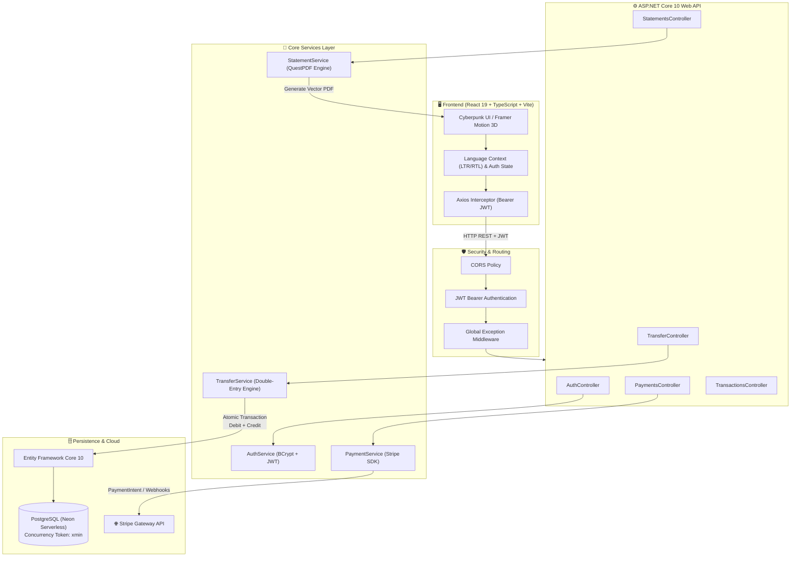

<div align="center">

# 💎 NovaPay

### **Next-Generation Cloud-Native FinTech Wallet & Double-Entry Ledger Engine**

[](https://dotnet.microsoft.com/)
[](https://react.dev/)
[](https://www.typescriptlang.org/)
[](https://neon.tech/)
[](https://tailwindcss.com/)
[](https://stripe.com/)
[](https://www.docker.com/)

<p align="center">
  <a href="https://nova-pay-rho.vercel.app" target="_blank"><b>🌐 Live Web App</b></a> •
  <a href="https://novapay-47ni.onrender.com/swagger" target="_blank"><b>📑 Swagger API Docs</b></a> •
  <a href="#-architecture--workflow"><b>🏛️ Architecture</b></a> •
  <a href="#-api-reference"><b>🔌 API Reference</b></a> •
  <a href="#-getting-started"><b>🚀 Quick Start</b></a>
</p>

</div>

---

## 🌟 Executive Summary

**NovaPay** is an enterprise-grade, high-throughput digital wallet and ledger accounting platform built to simulate modern financial technology core banking infrastructure. Engineered on **ASP.NET Core (.NET 10)** and **React 19 with Vite & Tailwind CSS v4**, NovaPay combines **immutable double-entry bookkeeping**, **strict ACID database transactions**, **PostgreSQL concurrency token isolation**, **Stripe payment gateway automation**, and **QuestPDF vector statement generation**.

Designed with bank-grade financial precision (`decimal(18, 4)`) and an immersive cyber-fintech UI complete with 3D virtual cards, cash flow analytics, and native **English / Arabic (RTL)** localization.

---

## ✨ Core Features

### 🏦 Core Banking & Ledger Engine
* **Strict Double-Entry Bookkeeping:** Every financial movement creates balanced debit and credit entries with exact historical `BalanceAfter` state snapshots.
* **ACID Atomic Execution:** P2P transfers execute inside isolated `IDbContextTransaction` blocks—guaranteeing zero orphaned records or partial balances.
* **Optimistic Concurrency Control:** Integrated with PostgreSQL’s native system column `xmin` row versioning to eliminate race conditions and double-spending.
* **Financial Precision:** Strict `(18, 4)` decimal precision across all monetary columns to eradicate floating-point rounding errors.
* **Immutable Audit Trail:** `DeleteBehavior.Restrict` enforcement ensures transactional and ledger history can never be wiped or tampered with.

### 💳 Payments & Gateway Integration
* **Stripe Payment Intent Pipeline:** Clean two-step top-up workflow (`create-intent` & `confirm-intent`) to fund wallets instantly via credit/debit card simulations.
* **Cryptographic Webhook Handlers:** Verification of Stripe signature headers (`Stripe-Signature`) guaranteeing idempotent transaction processing.

### 📄 Reporting & Business Intelligence
* **Dynamic PDF Statements:** High-resolution vector PDF generation powered by **QuestPDF**, generating branded account statements with itemized ledger records and financial health summaries.
* **Interactive Cash Flow Analytics:** Real-time inflow vs. outflow charts powered by **Recharts**.
* **AI Financial Advisor Drawer:** Dynamic liquidity calculations, spend velocity metrics, and automated cash reserve recommendations.

### 🎨 Next-Gen User Experience
* **3D Virtual Card:** Interactive card built with **Framer Motion**, offering 3D tilt physics, balance visibility toggle, and instant account number clipboard copying.
* **Full Bilingual Support:** Native **English & Arabic (العربية)** with bi-directional layout adaptation (LTR / RTL) and localized currency handling.
* **Cyber Aesthetic Background:** Dynamic HTML5 Canvas particle network with ambient glowing light orbs.
* **Transfer Celebration:** Interactive confetti burst feedback on completed settlements via `canvas-confetti`.

---

## 🏛 Architecture & Workflow

NovaPay enforces clean separation of concerns, decoupling presentation from domain logic and transactional ledger execution:



---

## ⚖️ Double-Entry Ledger Mechanics

In NovaPay, account balances are not simply overwritten. Every transfer creates a root **Transaction** record and two matching **LedgerEntry** rows:

$$\sum \text{Debits} = \sum \text{Credits}$$

```
                ┌───────────────────────────────────────┐
                │        Transaction (P2P Transfer)     │
                │        Reference: TX-2026-XXXXXXXX    │
                │        Amount: $150.00 | Status: Done │
                └──────────────────┬────────────────────┘
                                   │
         ┌─────────────────────────┴─────────────────────────┐
         ▼                                                   ▼
┌─────────────────────────────┐             ┌─────────────────────────────┐
│    Sender Ledger Entry      │             │   Recipient Ledger Entry    │
├─────────────────────────────┤             ├─────────────────────────────┤
│ Type: DEBIT (-)             │             │ Type: CREDIT (+)            │
│ Amount: $150.00             │             │ Amount: $150.00             │
│ Wallet: Sender Wallet       │             │ Wallet: Recipient Wallet    │
│ BalanceAfter: Old - $150    │             │ BalanceAfter: Old + $150    │
└─────────────────────────────┘             └─────────────────────────────┘
```

* **Data Isolation:** Prevented from deleting parent records (`OnDelete(DeleteBehavior.Restrict)`).
* **Audit Ready:** Every entry captures an exact immutable snapshot of `BalanceAfter` at the precise microsecond of execution.

---

## 🛠️ Technology Stack

| Layer | Technologies |
| :--- | :--- |
| **Backend Framework** | [.NET 10](https://dotnet.microsoft.com/) / ASP.NET Core Web API / C# 13 |
| **ORM & Database** | [Entity Framework Core 10](https://docs.microsoft.com/ef/core/) • [Npgsql](https://www.npgsql.org/) • [Neon Serverless PostgreSQL](https://neon.tech/) |
| **Security & Auth** | JWT (JSON Web Tokens) • BCrypt.Net-Next • Cryptographic Webhook Signatures |
| **Document Generation** | [QuestPDF](https://www.questpdf.com/) (Vector A4 Engine) |
| **Payment Gateway** | [Stripe.net](https://stripe.com/docs/api) (Payment Intents, Webhooks) |
| **Frontend Framework** | [React 19](https://react.dev/) • [TypeScript](https://www.typescriptlang.org/) • [Vite](https://vitejs.dev/) |
| **Styling & Animation** | [Tailwind CSS v4](https://tailwindcss.com/) • [Framer Motion](https://www.framer.com/motion/) • [Lucide Icons](https://lucide.dev/) |
| **Visualizations & FX** | [Recharts](https://recharts.org/) • [Canvas Confetti](https://www.npmjs.com/package/canvas-confetti) • HTML5 Canvas Particles |
| **Containerization & Hosting** | [Docker](https://www.docker.com/) • [Render](https://render.com) (API) • [Vercel](https://vercel.com) (Client) |

---

## 🔌 API Reference

### 🔐 Authentication (`/api/auth`)
| Method | Endpoint | Description | Auth Required |
| :--- | :--- | :--- | :---: |
| `POST` | `/api/auth/register` | Register new user & automatically create wallet (`NP-2026-XXXXXX`) | ❌ No |
| `POST` | `/api/auth/login` | Authenticate with email/password and obtain JWT token | ❌ No |
| `GET` | `/api/auth/me` | Fetch authenticated user profile, wallet ID, balance, and account number | ✅ Yes |

### 💸 Peer-to-Peer Transfers (`/api/transfer`)
| Method | Endpoint | Description | Auth Required |
| :--- | :--- | :--- | :---: |
| `POST` | `/api/transfer` | Execute atomic double-entry transfer by Recipient Account # or Email | ✅ Yes |

### 💳 Stripe Payments (`/api/payments`)
| Method | Endpoint | Description | Auth Required |
| :--- | :--- | :--- | :---: |
| `POST` | `/api/payments/create-intent` | Initialize Stripe PaymentIntent for wallet top-up | ✅ Yes |
| `POST` | `/api/payments/confirm-intent/{id}` | Confirm PaymentIntent and credit wallet balance atomically | ✅ Yes |
| `POST` | `/api/payments/webhook` | Stripe event listener verifying `Stripe-Signature` | ❌ No (Stripe IP) |

### 📊 History & Ledger (`/api/transactions`)
| Method | Endpoint | Description | Auth Required |
| :--- | :--- | :--- | :---: |
| `GET` | `/api/transactions` | Paginated ledger history with filters (`pageNumber`, `pageSize`, `type`, `startDate`, `endDate`) | ✅ Yes |
| `GET` | `/api/transactions/{id}` | Get detailed breakdown of a single transaction | ✅ Yes |

### 📑 Financial Statements (`/api/statements`)
| Method | Endpoint | Description | Auth Required |
| :--- | :--- | :--- | :---: |
| `GET` | `/api/statements/download` | Download branded Vector PDF statement for a specific date range | ✅ Yes |

---

## 🚀 Getting Started

### 📋 Prerequisites
* [.NET 10 SDK](https://dotnet.microsoft.com/download/dotnet/10.0)
* [Node.js (v20+)](https://nodejs.org/) & [npm](https://www.npmjs.com/)
* [PostgreSQL](https://www.postgresql.org/) instance (or a free [Neon](https://neon.tech/) connection string)
* [Stripe Account](https://stripe.com/) (Test API keys)

---

### 1️⃣ Backend Setup

1. **Clone repository:**
   ```bash
   git clone https://github.com/yusefalsalman/NovaPay.git
   cd NovaPay
   ```

2. **Configure environment settings:**
   Update `appsettings.Development.json` (or set environment variables):
   ```json
   {
     "ConnectionStrings": {
       "DefaultConnection": "Host=your-postgres-host;Database=novapay;Username=your-user;Password=your-pass;SSL Mode=Require;"
     },
     "Jwt": {
       "Key": "YourSuperSecretKeyWithAtLeast32CharactersLength!",
       "Issuer": "NovaPayAPI",
       "Audience": "NovaPayClients"
     },
     "Stripe": {
       "SecretKey": "sk_test_...",
       "PublishableKey": "pk_test_...",
       "WebhookSecret": "whsec_..."
     }
   }
   ```

3. **Apply EF Core database migrations:**
   ```bash
   dotnet ef database update
   ```

4. **Run the API server:**
   ```bash
   dotnet run
   ```
   * Swagger will be accessible at: `http://localhost:5218/swagger`

---

### 2️⃣ Frontend Setup

1. **Navigate to the client directory:**
   ```bash
   cd client
   ```

2. **Install dependencies:**
   ```bash
   npm install
   ```

3. **Configure client environment:**
   Create or edit `client/.env`:
   ```env
   VITE_API_BASE_URL=http://localhost:5218
   ```

4. **Launch development server:**
   ```bash
   npm run dev
   ```
   * The web application will open at: `http://localhost:5173`

---

### 🐳 Docker Deployment

A production-ready multi-stage [Dockerfile](file:///c:/Abu-Seef/programming/backend/Full_Stack_Projects/NovaPay/Dockerfile) is included:

```bash
# Build Docker image
docker build -t novapay-api .

# Run container
docker run -d -p 8080:8080 \
  -e ConnectionStrings__DefaultConnection="Your_Postgres_Connection_String" \
  -e Jwt__Key="Your_Jwt_Key" \
  -e Stripe__SecretKey="sk_test_..." \
  novapay-api
```

---

## 📁 Repository Structure

```
NovaPay/
├── controller/                 # ASP.NET Core API Controllers
│   ├── AuthController.cs
│   ├── PaymentsController.cs
│   ├── StatementsController.cs
│   ├── TransactionsController.cs
│   └── TransferController.cs
├── data/                       # EF Core DbContext & Database Configurations
│   └── NovaPayDbContext.cs
├── middleware/                 # Custom Exception & Request Logging Middlewares
│   ├── GlobalExceptionMiddleware.cs
│   └── RequestLoggingMiddleware.cs
├── Migrations/                 # EF Core DB Schema Evolution Migrations
├── model/                      # Domain Entities, Enums & Transfer DTOs
│   ├── User.cs
│   ├── Wallet.cs
│   ├── Transaction.cs
│   ├── LedgerEntry.cs
│   └── ...
├── service/                    # Business Logic Layer
│   ├── AuthService.cs
│   ├── TransferService.cs
│   ├── PaymentService.cs
│   ├── StatementService.cs
│   └── StatementDocument.cs    # QuestPDF Vector Layout Definition
├── client/                     # React 19 Frontend Application
│   ├── src/
│   │   ├── components/         # 3D Cards, Modals, Tables, Charts & Drawers
│   │   ├── context/            # Language (EN/AR & RTL) State Provider
│   │   ├── lib/                # Axios API Client & JWT Interceptors
│   │   └── types/              # TypeScript Interfaces & Models
│   ├── package.json
│   └── vite.config.ts
├── Dockerfile                  # Multi-stage production container build
├── Program.cs                  # Web Application Dependency Injection & Middleware
└── NovaPay.csproj              # .NET 10 Project Manifest
```

---

## 🗺️ Project Roadmap

- [x] **Phase 0:** Database Hardening & Concurrency Isolation (`xmin` row versioning)
- [x] **Phase 1:** JWT Bearer Authentication & Wallet Lifecycle
- [x] **Phase 2:** Atomic Double-Entry P2P Transfer Engine
- [x] **Phase 3:** Stripe Gateway Integration & Cryptographic Webhooks
- [x] **Phase 4:** Transaction History Querying & QuestPDF Vector Statements
- [x] **Phase 5:** React 19 FinTech Client (3D Card, Recharts, RTL Arabic Support)
- [ ] **Phase 6:** Autonomous AI Financial Advisor (Google Gemini API Integration)

---

## 🤝 Contributing

Contributions, issues, and feature requests are welcome!
Feel free to check the [issues page](https://github.com/yusefalsalman/NovaPay/issues).

1. Fork the Project
2. Create your Feature Branch (`git checkout -b feature/AmazingFeature`)
3. Commit your Changes (`git commit -m 'Add some AmazingFeature'`)
4. Push to the Branch (`git push origin feature/AmazingFeature`)
5. Open a Pull Request

---

## 📄 License

This project is licensed under the **MIT License** — see the [LICENSE](LICENSE) file for details.

---

<div align="center">
  <sub>Engineered with ❤️ by <a href="https://github.com/yusefalsalman">Yousef Salman</a></sub>
</div>
